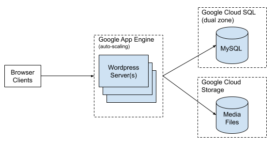
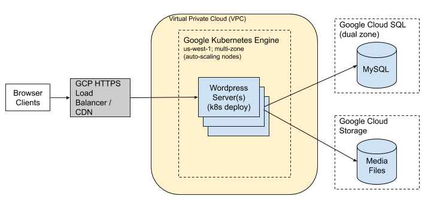

# Wordpress on Google Cloud Platform

## Introduction + Criteria

Wordpress is content management system (CMS) that consists of two core components: (1) a web server written in PHP and (2) MySQL for persistence¹. Any deployment must address these two components.

Any deployment strategy must address the following constraints:

- scale easily for an expected 10k/month increase in active users
- scale to handle substantial spikes in user traffic over a 24hr period on the 1st and 15th of each month²
- provide high uptime and low infrastructure complexity
- provide the lowest latency responses to users in San Francisco and Tokyo

## Deployment Options

Google Cloud recommends three deployment strategies for Wordpress [2]. Two strategies, Google App Engine and Google Kubernetes Engine, are viable given the scalability requirements.

### Option 1: Google App Engine + Cloud SQL

Google App Engine (GAE) is a managed serverless platform. Wordpress is written in PHP which is supported by GAE's standard environment. This leads to a relatively simple deployment strategy as illustrated in the architecture diagram below.

#### Pros

- GAE auto-scales to handle increased user traffic. Scaling can be triggered by (1) CPU Utilization, (2) Throughput Utilization, and (3) Max Concurrent Connections.
- Limited operational overhead

#### Cons

- GAE does not appear to integrate with Google CDN, which means more traffic will be handled by the application servers.
- Less flexible than Option 2 in terms of adding components / making modification (also the reason it has far less management overhead)
- Secrets management does not appear robust. Would likely need to inject secrets (e.g. database password) in via CI (if automated deploys are desired).
- MySQL is would be configured with failover, but any failover would result in downtime

### Option 2: Google Kubernetes Engine + Cloud SQL

Google Kubernetes is a managed Kubernetes platform for deploying containerized applications. A high-level architectural diagram is below.

#### Pros

- flexibility to adjust system components
- simple CDN integration
- simple secrets management

#### Cons

- managing GKE is relatively simple, but has substantially more overhead than GAE
- MySQL is would be configured with failover, but any failover would result in downtime

### Analysis + Recommendation

Option 1 (GAE) is likely the best solution because it significantly minimizes operational overhead relative to other options. It should be able to handle the increasing active users and spikes 2x month. The most likely issue will be related to overtaxing MySQL in terms of queries or connection count. This can be mitigated by (1) vertically scaling MySQL to handle spikes or (2) implementing caching (e.g. redis/memorystore) via a plugin [3] (note this plugin has not been investigated) to reduce queries. Note that auto-scaling would need to be limited in order to not exceed Cloud SQL's max connections [4].

GKE provides more flexiblity over time but at the cost of increased operation overhead. For example, with the GKE implementation we could leverage caching at a CDN or at the application level (e.g. nginx sidecar - high cache misses relative to CDN). However, based on the specified constraints, these benefits do not initially appear to outweigh the operational complexity of using Kubernetes.

Not discussed is deploying Wordpress directly on a VM. This has similar complexity to GKE once you handle auto-scaling, so was not addressed because GKE would be a better solution in that circumstance.

### Deployment Automation

Both options could be managed via Git workflows with deployment to a staging environment prior to production.

Footnotes:
¹By default Wordpress stores media file on disk. Google provides a plugin that stores allows media files to be stored in Google Cloud Storage [1].
²User base is U.S. (West Coast) and Japan, which are 16 hours apart. Likely result in sustained increased activity for the 24hr period.

References:
[1] https://wordpress.org/plugins/gcs/
[2] https://cloud.google.com/wordpress
[3] https://wordpress.org/plugins/redis-cache/
[4] https://cloud.google.com/sql/docs/mysql/connect-app-engine#connection_limits]
https://wordpress.org/support/